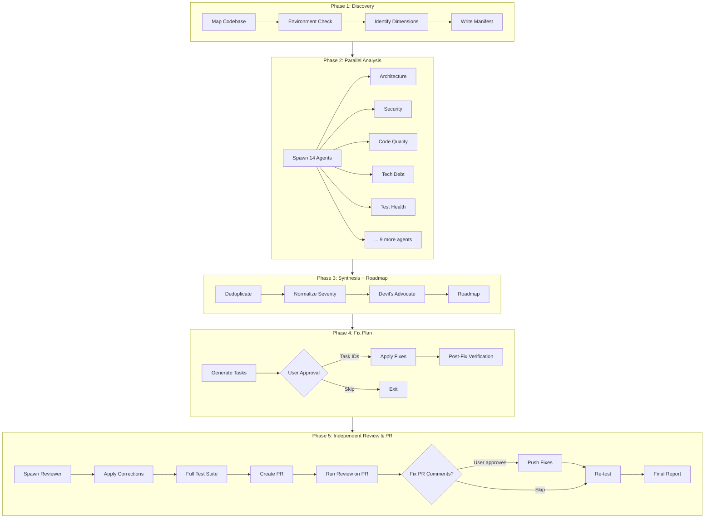

<div align="center">

# Complete Codebase Review

### AI-powered holistic codebase audit — 14 specialist agents, zero false positives, no code changes without your approval.

[](https://github.com/artgaurav16420-oss/Complete-Codebase-Review/actions)
[](https://opensource.org/licenses/MIT)
[](https://www.python.org)
[](https://github.com/artgaurav16420-oss/Complete-Codebase-Review)
[](https://github.com/artgaurav16420-oss/Complete-Codebase-Review)
[](https://github.com/artgaurav16420-oss/Complete-Codebase-Review)
[](http://makeapullrequest.com)
[](https://github.com/artgaurav16420-oss/Complete-Codebase-Review/graphs/commit-activity)



</div>

---

## ✨ Features

<table>
<tr>
<td width="50%">

### 🔍 Deep Discovery
Maps languages, frameworks, build systems, entry points, git churn, and config across your entire codebase — cross-platform (Windows, macOS, Linux).

</td>
<td width="50%">

### 🧠 14 Specialist Agents
Architecture, Security, Code Quality, Tech Debt, Test Health, Dependencies, Documentation, Build & CI, Performance, Database, UI/UX, DevOps, Standards, Process Quality — in parallel.

</td>
</tr>
<tr>
<td width="50%">

### ✅ Devil's Advocate QA
Every finding is independently challenged, web-verified, and classified (CONFIRMED / PLAUSIBLE / QUESTIONABLE / REJECTED). Zero false positives.

</td>
<td width="50%">

### 📈 Trend Tracking
Saves baseline snapshots across sessions. Track health score, tech debt, and critical issue counts over time.

</td>
</tr>
<tr>
<td width="50%">

### 🔒 Read-Only Safe
No code modifications during Phases 1-3. Phase 4 fix plan waits for your explicit approval — task by task or "all".

</td>
<td width="50%">

### 🌍 Cross-Platform
Works identically on Windows PowerShell and Unix bash. Auto-detects OS, uses platform-native commands.

</td>
</tr>
</table>

### How It Compares

| Criterion | Manual Review | Single-Agent Audit | Complete Codebase Review |
|-----------|--------------|-------------------|------------------------|
| Coverage | Inconsistent | Single domain | 14 domains in parallel |
| False positives | High (subjective) | Moderate | Minimal (DA-verified) |
| Quantified tech debt | Guesswork | Rough estimate | Per-finding hour estimates |
| Trend tracking | None | None | Baseline snapshots |
| Fix plan | Manual notes | One-off suggestions | Structured tasks with deps |
| Time for 50K LOC repo | 2-5 days | 15-30 min | 5-15 min |

---

## 📸 Example Output

Here's a real health report excerpt for a medium-sized web application:

```markdown
# Codebase Health Report — my-web-app (src/)

## Executive Summary
- **Overall Health**: YELLOW
- **Codebase Size**: 47,320 LOC, 312 files, 8 modules
- **Critical Issues**: 3
- **Tech Debt**: 214 engineering hours
- **Priority Areas**: Security, Architecture, Test Health

## Per-Domain Scores
| Domain | Score (/10) | Critical | High | Medium | Low |
|--------|------------|----------|------|--------|-----|
| Architecture | 6 | 1 | 2 | 3 | 1 |
| Security | 4 | 2 | 3 | 1 | 0 |
| Test Health | 5 | 0 | 2 | 2 | 1 |
| ... | ... | ... | ... | ... | ... |
| **Overall** | **6.5** | **3** | **11** | **16** | **15** |

## Detailed Findings
| Finding | Severity | Domain | Est. Hours | DA Verdict |
|---------|----------|--------|------------|------------|
| Hardcoded DB password | CRITICAL | Security | 2h | CONFIRMED |
| Circular dep: auth→user→notification→auth | CRITICAL | Architecture | 8h | CONFIRMED |
| Test coverage <20% in 3 of 8 modules | HIGH | Test Health | 12h | PLAUSIBLE |
| ... | | | | |
```

The full report includes a 3-phase improvement roadmap, tech debt breakdown by domain, and agent completion status.

---

## 🚀 Quick Start

```bash
# Install (one command)
curl -fsSL https://raw.githubusercontent.com/artgaurav16420-oss/Complete-Codebase-Review/main/install.py | python3

# Run a review
/complete-codebase-review .

# Quick mode (3 agents, 120s timeout)
export CODE_REVIEW_EFFORT=min
/complete-codebase-review src/
```

> **Security note:** The one-liner pipes from HTTPS. For production use, verify the script checksum after download:
> ```bash
> curl -fsSL -o install.py https://raw.githubusercontent.com/artgaurav16420-oss/Complete-Codebase-Review/main/install.py
> # Review the script, then run:
> python3 install.py
> ```

That's it. You'll get a full health report in 5-15 minutes.

---

## 📦 Installation

### One-line Install (Recommended)

```bash
curl -fsSL https://raw.githubusercontent.com/artgaurav16420-oss/Complete-Codebase-Review/main/install.py | python3
```

The installer detects your environment (Claude Code, OpenCode, Cursor, Continue) and places the skill in the correct directory. See [install.py](install.py) for details.

### Manual Install

```bash
git clone https://github.com/artgaurav16420-oss/Complete-Codebase-Review.git ~/.claude/skills/complete-codebase-review
```

### Verify Installation

```bash
# The skill registers as a slash command. Run in your agent:
/complete-codebase-review --help

# Or run the compliance test suite:
python3 tests/test_compliance.py
```

---

## 🔧 Configuration

Customize execution with environment variables:

| Variable | Default | Description |
|----------|---------|-------------|
| `CODE_REVIEW_EFFORT` | `max` | Execution effort. Set to `min` for Quick Mode (3 agents, 120s timeout). |
| `CODE_REVIEW_TIMEOUT_SEC` | `900` | Per-agent timeout in seconds. |
| `CODE_REVIEW_MAX_FILES` | unlimited | Max files to scan. Limits runtime on huge codebases. |
| `CODE_REVIEW_CACHE_DIR` | `.code-review-cache` | Directory for checkpointing and caching. |
| `CODE_REVIEW_BASELINE` | `ccr-baseline.json` | Baseline snapshot filename for trend tracking. |
| `CODE_REVIEW_AGENTS` | all applicable | Comma-separated agent names (e.g. `security,architecture`). |
| `CODE_REVIEW_STATUS_INTERVAL` | `300` | Minimum seconds between event-driven status log lines ('X/Y agents completed'). Logged on agent result receipt, not a background timer. |
| `CODE_REVIEW_FILTER` | `all` | Output filter. Set to `critical-high` to show only CRITICAL+HIGH findings. |

See [help.md](help.md) for detailed documentation.

### Quick Mode

```bash
export CODE_REVIEW_EFFORT=min
export CODE_REVIEW_TIMEOUT_SEC=120

/complete-codebase-review .
```

Runs Security, Code Quality, and Architecture agents with a ~10% codebase sample. Ideal for CI pipelines or quick sanity checks.

---

## 🏗 Architecture

The review runs in five phases:

### Phase 1: Discovery
Maps the codebase: languages, frameworks, build systems, directory structure, entry points, git history. Runs an environment check to verify tool availability. Identifies which of the 14 health dimensions apply to this project.

**Phase 2: Parallel Analysis**
Spawns up to 14 specialist agents simultaneously. Each agent loads a domain-specific skill, runs methodology-driven analysis, quantifies findings, and web-verifies claims. Agents time out independently — partial results are preserved.

### Phase 3: Synthesis → DA → Roadmap
Deduplicates findings, normalizes severity, and resolves cross-agent
conflicts. The Devil's Advocate agent then independently challenges
every finding, web-verifies claims, and assigns
CONFIRMED/PLAUSIBLE/QUESTIONABLE/REJECTED verdicts. Only after DA
verification does the Roadmap agent prioritize findings by impact
vs. effort across 3 phases.

### Phase 4: Fix Plan
Generates structured fix tasks (T-001, T-002, ...) with effort estimates and dependencies. Presents the plan for your approval — apply specific tasks by ID, apply all, or skip. After fixes, runs post-fix verification (lint, type check, tests).

### Phase 5: Independent Review & PR
An independent agent audits all applied fixes, applies any necessary corrections, runs the full test suite, creates a pull request with the fixes, runs an automated review on the PR using the `review` skill, presents all AI bot review comments for your approval, then re-tests and delivers a final report. Requires [GitHub CLI (`gh`)](https://cli.github.com) for PR creation and review posting.

---

## ❓ FAQ

<details>
<summary><b>Does it modify my code?</b></summary>
<b>No.</b> Phases 1-3 are strictly read-only. Phase 4 generates a fix plan and only applies changes after you explicitly approve tasks (by ID or "all").
</details>

<details>
<summary><b>How long does a review take?</b></summary>
For a 50K LOC codebase, expect 5-15 minutes in full mode. Quick Mode (`CODE_REVIEW_EFFORT=min`) completes in 2-5 minutes. Time scales with codebase size and agent count.
</details>

<details>
<summary><b>Can I run specific agents?</b></summary>
Yes. Set `CODE_REVIEW_AGENTS=security,architecture,code-quality` to run only those domains. The full set is filtered by project health dimensions by default.
</details>

<details>
<summary><b>What if an agent fails or times out?</b></summary>
Agents retry once on transient errors. If they exceed the timeout, the review proceeds with partial results and notes the gap. If fewer than 75% of agents complete, the review halts (insufficient coverage).
</details>

<details>
<summary><b>Does it work on monorepos?</b></summary>
Yes. Cross-platform commands handle any directory structure. Use `CODE_REVIEW_MAX_FILES` to limit scope on very large repositories.
</details>

<details>
<summary><b>Can I integrate this into CI/CD?</b></summary>
Yes. Run in Quick Mode (`CODE_REVIEW_EFFORT=min`) for fast checks. The exit code reflects pass/fail status, making it suitable for CI pipelines. See the [CI workflow](.github/workflows/ci.yml) for a reference.
</details>

---

## 🤝 Contributing

[](http://makeapullrequest.com)
[](https://www.conventionalcommits.org)

We welcome contributions of all sizes. Here's how to get started:

1. **Fork** the repo and create a feature branch.
2. **Write tests** for any new functionality. Test suites migrated to Python — see [test_compliance.py](tests/test_compliance.py) and [test_install.py](tests/test_install.py).
3. **Run the test suite**: `python3 tests/test_compliance.py`
4. **Submit a PR** with a clear description of the change and any related issue.

### Development

```bash
# Clone and install
git clone https://github.com/artgaurav16420-oss/Complete-Codebase-Review.git
cd Complete-Codebase-Review

# Run compliance tests
python3 tests/test_compliance.py

# Run bash test suite
./test.sh
```

### Code of Conduct

This project follows the [Contributor Covenant](https://www.contributor-covenant.org/) code of conduct. Please be respectful and constructive in all interactions.

---

## 📊 Test Suite

| Suite | Command | Coverage |
|-------|---------|----------|
| Python compliance | `python3 tests/test_compliance.py` | 139 assertions across 63 test functions |
| Python unit tests | `python3 -m unittest discover -s tests -p "test_*.py"` | All unittest suites (157 tests) |
| Install tests | `python3 tests/test_install.py` | 49 tests across 9 classes |
| Pipeline validation | `python3 tests/test_pipeline.py` | Review output schema validation |
| Env-var config | `python3 tests/test_env_config.py` | Env-var table completeness checks |
| Bash integration | `./test.sh` | CLI and cross-platform behavior (Unix only) |
| Windows test | `powershell tests/Test-Windows.ps1` | Compliance + install + mock checks for Windows devs |

---

## 📝 License

MIT. See [LICENSE](LICENSE) for details.

---

<div align="center">

### ⭐ If you find this useful, star the repo — it helps others discover it.

[](https://github.com/artgaurav16420-oss/Complete-Codebase-Review/stargazers)
[](https://github.com/artgaurav16420-oss)

Built by **Gaurav**. Powered by AI agents.

</div>
