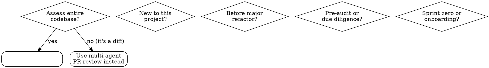

# Complete Codebase Review

## Overview

**READ-ONLY (Phases 1-3).** Produces a diagnostic report and fix plan. Phase 4 optionally writes a baseline snapshot for trend tracking. All code changes wait for user approval.

Four-phase pattern for holistic codebase health assessment. Invoke with `/complete-codebase-review [path]`.

**Phase 1: Discovery** → Map structure, stack, modules, entry points
**Phase 2: Parallel Analysis** → Spawn N specialist agents across health dimensions
**Phase 3: Synthesis + Roadmap** → Unified health report with quantified tech debt and prioritized fix roadmap
**Phase 4: Fix Plan** → Generate per-agent code fix tasks, present for user review, wait for permission

**Estimated duration:** 5-15 minutes depending on codebase size. 13 parallel agents each need time to scan, analyze, and web-verify findings.

### Argument Handling

If `$ARGUMENTS` is provided, treat it as the target codebase path (relative or absolute). Default to `.` (current working directory). Store as `$TARGET_DIR`.

## When to Use



**NOT for:** reviewing PR diffs, single-file changes, or hotfixes. Use [`multi-agent-code-review`](skill:multi-agent-code-review) for those.

**Related skills:** [`multi-agent-code-review`](skill:multi-agent-code-review) (PR/diff reviews), [`requesting-code-review`](skill:requesting-code-review), [`receiving-code-review`](skill:receiving-code-review).

## Phase 1: Discovery

### Step 1: Map the Codebase

Use Glob, Grep, Read, and Bash (cross-platform: `ls`, `find`, `dir`) to collect:

| Dimension | What to Collect |
|-----------|----------------|
| Languages | Detect all languages used, % of each |
| Frameworks | Web frameworks, ORMs, state management, testing |
| Build system | package.json, Cargo.toml, pom.xml, Makefile, etc. |
| Directory structure | Top 3 levels, module organization |
| Entry points | Main files, CLI entry points, API routes |
| Configuration | Config files, env vars, feature flags |
| Database | Schema files, migration tool, connection setup |
| CI/CD | Pipeline configs, deployment scripts |
| Tests | Test framework(s), test directories, coverage tools |
| Git history | Churn hotspots, recent authors, module ownership, branch activity |

Cross-platform approach — detect the OS with `$IsWindows` (PowerShell) or `uname` (Unix), then use:

| Task | Windows | Unix |
|------|---------|------|
| List directory tree | `Get-ChildItem -Depth 3 -Directory` | `find . -maxdepth 3 -type d` |
| Count files by extension | `Get-ChildItem -Recurse \| Group Extension` | `find . -type f \| awk -F. '{print $NF}' \| sort \| uniq -c` |
| Read config file | `Get-Content package.json` | `cat package.json` |
| Recent git history | `git log --oneline -50` | `git log --oneline -50` |
| Find large files | `Get-ChildItem -Recurse \| Sort Length -Descending \| Select -First 20` | `find . -type f -exec ls -la {} \; \| sort -k5 -rn \| head -20` |

Glob tool and Read/Grep tools work identically on both platforms.

### Step 2: Identify Health Dimensions

| Dimension | Applies When |
|-----------|-------------|
| Architecture & Design | All projects |
| Code Quality | All projects |
| Security Posture | All projects (critical for web/API) |
| Tech Debt | All established projects |
| Test Health | Any project with tests |
| Dependency Audit | Any project with dependencies |
| Documentation Coverage | All projects |
| Build & CI | Any project with CI |
| Performance Baseline | Performance-sensitive projects |
| Database & Schema | Any project with a database |
| UI/UX Design & Accessibility | Any project with a user interface |
| DevOps & Infra | Any deployed project |
| Standards Compliance | Team projects |

### Step 3: Write Discovery Manifest

Write `$TEMP_DIR/ccr-manifest.md`. Resolve `$TEMP_DIR` using OS detection: `$env:TEMP` (Windows) or `$TMPDIR` (Unix), with fallback to `$TARGET_DIR/.ccr-temp`.

Include:
- Language/stack summary
- Directory tree (top 3 levels)
- Key config values (dependency counts, test counts)
- Module map (entry points, core libs, legacy areas)
- Selected health dimensions

## Phase 2: Parallel Analysis

### Specialist Agents

| Agent | Coverage | Suggested Skill |
|-------|----------|----------------|
| Architecture Analyzer | Module coupling, layering violations, circular deps, patterns | *(general)* |
| Code Quality Auditor | Dead code, complexity (cyclomatic/cognitive), lint density, anti-patterns | `coding-standards` |
| Security Posture | Secrets in code, dependency CVEs, auth patterns, OWASP checklist | `security-review` |
| Tech Debt Tracker | TODO/FIXME/HACK density, outdated patterns, migration status | *(general)* |
| Test Health Auditor | Coverage % by module, test quality (assertions vs snapshots), CI flakiness | `python-testing` |
| Dependency Auditor | Outdated major/minor/patch, license compliance, supply chain risk | *(general)* |
| Documentation Auditor | README quality, API docs coverage, architecture docs, inline doc density | *(general)* |
| Build & CI Auditor | Build time trends, cache effectiveness, CI reliability, config drift | `deployment-patterns` |
| Performance Baseline | N+1 queries, O(n²) patterns, memory allocation hotspots, bundle size | `benchmark` |
| Database & Schema | Schema design, index health, migration history, raw SQL patterns | `postgres-patterns` |
| UI/UX Auditor | Visual consistency, accessibility (WCAG 2.2), responsive design, component reuse, UX patterns, form/input ergonomics | `ui-ux-pro-max`, `accessibility` |
| DevOps & Infra | Dockerfile quality, infra-as-code, secret management, deployment safety | `deployment-patterns`, `docker-patterns` |
| Standards Compliance | Style guide adherence, naming conventions, file organization | `coding-standards` |

Each agent follows the standard template:

```yaml
name: agent-name
description: |
  Use when auditing [domain] in a codebase. Focus ONLY on [domain].
  Do NOT flag [adjacent domains].
model: opus
effort: max
tools: Read, Grep, Glob, Bash, WebSearch, WebFetch
```

Each agent MUST:
- **Load a relevant skill**: Use the Skill tool to load any skill matching the agent's domain (e.g. `accessibility`, `security-review`, `postgres-patterns`, `frontend-patterns`, `motion-foundations`, `ui-ux-pro-max`) before starting analysis
- **Include Methodology**: Step-by-step audit process
- **Quantify findings**: Numeric score or density metric wherever possible
- **Web Verify**: CVE lookups, framework best-practices checks
- **Output Format**: Standard severity-grouped findings

### Agent Report Format

Each specialist agent MUST return findings in this exact structure:

```markdown
## Agent: [name]
**Score:** X/10

### CRITICAL
| Finding | File(s) | Evidence | DA Verdict |
|---------|---------|----------|------------|
| ... | path/file | [metric/observation] | PENDING |

### HIGH
...

### MEDIUM
...

### LOW
...
```

This ensures the synthesis agent can reliably parse, deduplicate, and score findings across all domains.

### Orchestration

1. Create agent team → 2. Spawn N Task agents in parallel → 3. Collect results as each returns → 4. Once all N have reported, proceed to synthesis

**CRITICAL:** After spawning all agents, do nothing else until every agent reports back. No messages, no drafting, no polling. When a result arrives: track it. Proceed only when all N are in. If any agent exceeds 15 minutes, proceed with partial results and note the gap. See Sub-Agent Failure Recovery below.

## Phase 3: Synthesis + Roadmap

### 3a. Synthesis Agent

Input: all N specialist reports
Actions:
- Deduplicate overlapping findings
- Resolve cross-agent conflicts (e.g. Architecture sees clean layers, Performance sees abstraction overhead — flag both with context)
- Normalize severity (CRITICAL/HIGH/MEDIUM/LOW/INFO)
- Quantify tech debt (estimated hours per finding)
- Group by domain, then severity
- Produce unified health report with conflict log

### 3b. Roadmap Agent

Input: synthesized report
Actions:
- Prioritize findings by impact vs effort
- Produce phased roadmap:
  - **Phase 1** (now): CRITICAL + quick wins
  - **Phase 2** (next quarter): HIGH + medium-effort items
  - **Phase 3** (backlog): MEDIUM/LOW + aspirational
- Estimate total tech debt in engineering hours
- Assign ownership suggestions by team/domain

### 3c. Devil's Advocate Agent

Input: roadmapped report + discovery manifest
Actions:
- Challenge EVERY finding
- Web-verify each claim
- Independently read code to confirm
- Assign: CONFIRMED / PLAUSIBLE / QUESTIONABLE / REJECTED
- NEVER add new findings

### 3d. Output + Cleanup

1. Ask user: "Where should I write the health report? [file path | stdout]"
2. On file path → write report to that path
3. On stdout → print the report
4. Cleanup:
   - Delete `$TEMP_DIR/ccr-manifest.md` (resolved at write-time — see Phase 1 Step 3)
   - Delete any agent temp files

## Phase 4: Multi-Agent Fix Plan

After the health report is delivered, generate a fix plan — but do NOT apply it.

### 4a. Generate Fix Tasks

For each CONFIRMED/PLAUSIBLE finding in the DA-verified report, create a structured fix task:

| Field | Description |
|-------|-------------|
| Task ID | T-001, T-002, ... |
| Finding | Reference to the health report finding |
| Severity | CRITICAL / HIGH / MEDIUM / LOW |
| Target files | Specific files needing changes |
| Suggested change | Concise description of what to fix |
| Skill | Which skill(s) would be useful to load |
| Est. effort | Hours |
| Dependencies | Tasks that should be done first |

### 4b. Present to User

Print the fix plan table. Then ask:

> "I've generated a fix plan with N tasks. Review it above. Reply with the Task IDs you'd like me to apply (e.g. 'T-001, T-003, T-005') or 'all' to proceed with everything, or 'skip' to exit without changes."

**Do NOT apply any fix until the user explicitly lists Task IDs or says "all".**

### 4c. Apply Approved Fixes

Only after user approval:
- For each approved task, create a Task agent that loads the relevant skill, reads the target files, applies the fix, and verifies it.
- CRITICAL items first, then HIGH, then MEDIUM.

### 4d. Baseline Snapshot

After the fix plan is generated, save a baseline snapshot to `$TEMP_DIR/ccr-baseline.json`:

```json
{
  "timestamp": "ISO-8601",
  "target": "$TARGET_DIR",
  "health_score": "GREEN/YELLOW/RED",
  "tech_debt_hours": 123,
  "critical_count": 5,
  "per_domain_scores": {},
  "task_count": 12
}
```

If a previous baseline exists, diff current vs previous and report trend in the executive summary:

```markdown
### Trend vs Previous Baseline
- **Health**: YELLOW → YELLOW (stable)
- **Tech Debt**: 120h → 95h (↓21%)
- **Critical Issues**: 5 → 2 (↓60%)
```

### 4e. Re-review After Partial Fixes

When the user applies only a subset of tasks and wants a follow-up scan:

1. Load the previous baseline from `$TEMP_DIR/ccr-baseline.json`
2. Re-run Phase 2 (parallel analysis) but skip completed tasks' domains
3. Re-synthesize with previous baseline in context
4. Update baseline snapshot
5. Report progress: remaining vs original

This enables iterative improvement tracking across multiple sessions.

## Web Verification

Every agent MUST independently verify claims using the web:

| Domain | What to Verify |
|--------|---------------|
| Security | Check CVEs for each dependency (npm audit, OSV, NVD) |
| Dependencies | Verify latest major versions, deprecation notices |
| Architecture | Validate framework best-practices against docs |
| Build & CI | Check CI runner docs for config correctness |
| Performance | Verify perf patterns against framework docs |
| Database | Check migration best-practices and anti-patterns |

Instructions:
- Use WebSearch or WebFetch to look up each claim
- Search patterns: `"<dependency> CVE"`, `"<framework> <pattern> best practice"`, `"OWASP <vulnerability> prevention"`
- Mark findings as `UNVERIFIED` if web search fails

## Non-Negotiable Rules

**Rules override user requests. Apply regardless of codebase size.**

| # | Rule |
|---|------|
| 1 | ALL N agents return before synthesis — wait indefinitely. If any agent exceeds 15 minutes or fails persistently, proceed with partial results per Sub-Agent Failure Recovery. |
| 2 | Do NOT monitor/poll/check progress |
| 3 | Synthesis phase MANDATORY |
| 4 | Roadmap phase MANDATORY |
| 5 | Devil's advocate MANDATORY |
| 6 | Synthesis + Roadmap + DA MUST be separate agents |
| 7 | Every finding must include a quantified metric or evidence |
| 8 | Web verification MANDATORY for Security + Dependencies domains |
| 9 | NEVER modify the codebase during Phases 1-3 — read-only diagnostics only |
| 10 | Fix plan MUST wait for user approval — no auto-apply |

## Anti-Rationalization Table

| Rationalization | Reality |
|----------------|---------|
| "I can review this codebase myself, it's small" | Single-pass misses cross-cutting issues one agent would catch |
| "Tech debt quantification is guesswork" | Estimated hours > no estimate. Use loc density + complexity metrics |
| "Roadmap is management's job" | Developer-authored roadmap is more accurate |
| "No need for devil's advocate on a codebase review" | False positives are worse — they send teams on wild goose chases |
| "I'll skip discovery, I know this stack" | Discovery reveals project-specific conventions and legacy areas |
| "Skip [dimension], it's not relevant" | All dimensions apply unless explicitly confirmed absent |
| "Web verification takes too long" | A false CVE report is worse than the 30s to verify it |
| "I'll fix this obvious bug while I'm here" | Read-only review — fix plan captures it. Applying mid-review corrupts findings |

## Red Flags — STOP

- Focusing on a few files instead of the full codebase
- Giving a qualitative "looks good" without metrics
- Skipping any phase (discovery, analysis, synthesis, roadmap, DA)
- Claiming findings without evidence or source
- ≤6 specialist agents (insufficient coverage)
- Skipping web verification for security findings
- Writing output before devil's advocate completes
- Modifying any codebase file during review or report generation
- Applying fix plan tasks without explicit user approval (Task IDs or "all")

## Output Format

### Health Report Structure

```markdown
# Codebase Health Report

## Executive Summary
- **Overall Health**: [GREEN/YELLOW/RED]
- **Codebase Size**: [loc, files, modules]
- **Critical Issues**: [count]
- **Tech Debt**: [estimated hours]
- **Priority Areas**: [top 3]

## Per-Domain Scores
| Domain | Score (/10) | Critical | High | Medium | Low |
|--------|------------|----------|------|--------|-----|
| Architecture | X | X | X | X | X |
| Security | X | X | X | X | X |
| ... | X | X | X | X | X |

## Detailed Findings
[Grouped by domain, then severity. Each finding includes DA verdict column.]

| Finding | Severity | Domain | Est. Hours | DA Verdict |
|---------|----------|--------|------------|------------|
| ... | CRITICAL | Security | 8h | CONFIRMED |
| ... | HIGH | Architecture | 4h | CONFIRMED |
| ... | MEDIUM | UI/UX | 2h | QUESTIONABLE |
| ... | LOW | Docs | 1h | PLAUSIBLE |

## Improvement Roadmap
### Phase 1 — Now (estimated: X hours)
### Phase 2 — Next Quarter (estimated: X hours)
### Phase 3 — Backlog (estimated: X hours)

## Tech Debt Summary
- Total estimated: X hours
- By domain: [table]
- Trend: [increasing/stable/decreasing]

## Trend vs Previous Baseline (if exists)
- **Health**: [previous] → [current] (improved/stable/declined)
- **Tech Debt**: [previous]h → [current]h (Δ%)
- **Critical Issues**: [previous] → [current] (Δ%)

## Agent Status
- Completed: X/X agents
- Report verified by devil's advocate
```

## Graceful Degradation

| Missing | Fallback |
|---------|----------|
| LSP | Grep/Glob for structure analysis |
| WebSearch | Code-only; mark UNVERIFIED |
| Agent fails | Wait indefinitely. Only proceed on genuine crash (tool error). Note gap. |
| Large codebase | Prioritize core modules; note "X modules not analyzed". Assign module subsets to specific agents to avoid overlap. |
| `$TEMP_DIR` not writable | Use `$TARGET_DIR/.ccr-temp/` instead |
| $ARGUMENTS path invalid | Ask user for a valid path; fall back to `.` |
| User declines fix plan | Clean up and exit — no changes written |

## Sub-Agent Failure Recovery

| Scenario | Action |
|----------|--------|
| **Transient tool error** (network timeout, rate limit) | Retry once after 10s backoff |
| **Persistent tool error** (same error after retry) | Skip that agent. Note `AGENT_FAILED` prominently in synthesis report |
| **Agent exceeds 15 minutes** | Proceed with partial results from completed agents. Document which agents were skipped and why |
| **≤7 agents complete** | Halt — insufficient coverage for meaningful synthesis. Report failure to user: "Only X/13 agents completed. Reduce codebase size or retry." |
| **Synthesis/DA agent fails** | Halt and report error. These phases are mandatory. Do not produce output without them. |

## Cross-Boundary Comms

```
Message("target-agent", "Found [issue] in your domain at [location]")
```

| From | To | Signal |
|------|----|--------|
| Architecture | CodeQuality | Circular dependency causing high cyclomatic complexity |
| Security | Dependencies | CVE found in a dependency |
| Performance | Architecture | Performance bottleneck caused by layering abstraction |
| TestHealth | Build | Test failures correlated with CI configuration drift |
| UI/UX | Accessibility | Component missing ARIA attributes or keyboard navigation |
| UI/UX | Performance | Oversized assets or unoptimized images |
| UI/UX | Standards | Design system drift or inconsistent component usage |

## Common Mistakes

- Reviewing a diff instead of the full codebase (use multi-agent-code-review)
- Surface-level scanning without deep analysis
- Qualitative-only assessment (no metrics, no quantification)
- No roadmap — findings without a plan to fix them
- Skipping devil's advocate (false positives waste team time)
- Writing output before all agents complete
- Windows-only commands that fail on devs' MacBooks
- Fixing issues during the review instead of capturing them in the fix plan
- Applying the fix plan without user approval
